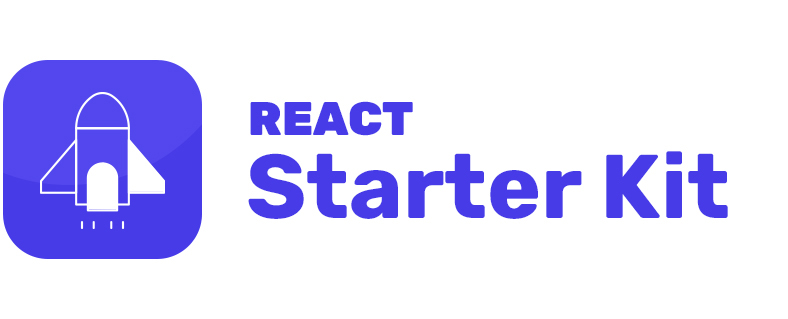

<div align="center">
  
  <p></p>
  <h1>React Web App</h1>
  <p></p>
  <a href="https://react-starter-kit.mcnam.ee/"></a>
  <p></p>
  <sup>
    <a href="https://github.com/mcnamee/react-starter-kit/actions">
      
    </a>
    <a href="/LICENSE">
      
    </a>
  </sup>
  <br />
  <p align="center">
    <a href="#-intro"><b>What is this?</b></a>
    &nbsp;&nbsp;&mdash;&nbsp;&nbsp;
    <a href="#-getting-started"><b>Usage</b></a>
    &nbsp;&nbsp;&mdash;&nbsp;&nbsp;
    <a href="#-docs"><b>Docs</b></a>
    &nbsp;&nbsp;&mdash;&nbsp;&nbsp;
    <a href="#-further-help"><b>Need help?</b></a>
  </p>
  <br />
</div>

---

### Looking for something else?

- [React Native Starter Kit / Boilerplate](https://github.com/mcnamee/react-native-starter-kit)
- [React Native Starter Kit (Expo) / Boilerplate](https://github.com/mcnamee/react-native-expo-starter-kit)
- [Previous Version (React Starter Kit (Web + Native) w/ Firebase)](https://github.com/mcnamee/react-native-starter-kit/tree/archive/v3)

---

## 👋 Intro

This project was bootstrapped with the [React Boilerplate Builder](https://github.com/mcnamee/react-native-boilerplate-builder) by [Matt McNamee](https://mcnam.ee).

The project is _super_ helpful to kick-start your next project, as it provides a lot of the common tools you may reach for, all ready to go. Specifically:

- __Flux architecture__
    - [Redux](https://redux.js.org/docs/introduction/)
    - Redux Wrapper: [Rematch](https://github.com/rematch/rematch)
- __Routing and navigation__
    - [React Router](https://github.com/ReactTraining/react-router) for web
- __Data Caching / Offline__
    - [Redux Persist](https://github.com/rt2zz/redux-persist)
- __UI Toolkit__
    - [Bootstrap](https://getbootstrap.com/) for web
- __Code Linting__ with
    - [Airbnb's JS Linting](https://github.com/airbnb/javascript) guidelines

---

## 🚀 Getting Started

- Install `eslint`, `prettier` and `editor config` plugins into your IDE

```bash
# Install dependencies
yarn install

# Run the app in the development mode
# Open [http://localhost:3000](http://localhost:3000) to view it in the browser.
yarn start

# Launches the test runner in the interactive watch mode
yarn test

# Builds the app for production to the `build` folder
# It correctly bundles React in production mode and optimizes the build for the best performance
yarn build

# Lint
./node_modules/.bin/eslint "src/**/*.js"
```

---

## 📖 Docs

- [Contributing to this project](documentation/contributing.md)
- [Tests & testing](documentation/testing.md)
- [Understanding the file structure](documentation/file-structure.md)
- [Create React App documentation](https://facebook.github.io/create-react-app/docs/getting-started)
- [React documentation](https://reactjs.org/)
- [Code Splitting](https://facebook.github.io/create-react-app/docs/code-splitting)
- [Analyzing the Bundle Size](https://facebook.github.io/create-react-app/docs/analyzing-the-bundle-size)
- [Making a Progressive Web App](https://facebook.github.io/create-react-app/docs/making-a-progressive-web-app)
- [Advanced Configuration](https://facebook.github.io/create-react-app/docs/advanced-configuration)
- [Deployment](https://facebook.github.io/create-react-app/docs/deployment)
- [`yarn run build` fails to minify](https://facebook.github.io/create-react-app/docs/troubleshooting#npm-run-build-fails-to-minify)

---

## 👊 Further Help?

This repo is a great place to start. But...if you'd prefer to sit back and have your new project built for you or just need some consultation, [get in touch with me directly](https://mcnam.ee) and I can organise a quote.
